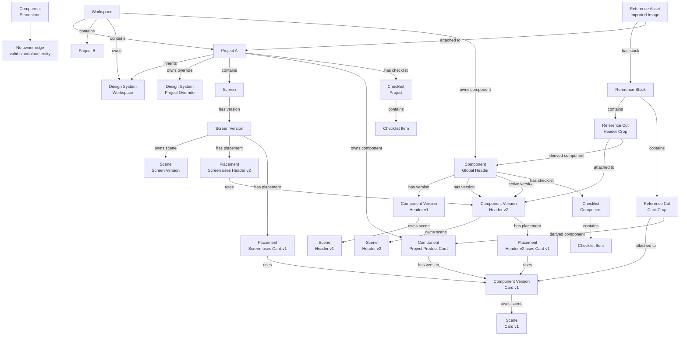

# Save Architecture v3 - Workspace Graph Storage

## What this document is

This document defines the next storage model for the application. It builds on
the v2 persistence rewrite, but changes the domain model from a mostly fixed
tree into a graph of independent entities and indexed relationships.

The goal is to support:

- Workspaces as the top-level collaborative and organizational boundary.
- Projects inside workspaces, without making projects the only possible root.
- Components that can be owned by a workspace, owned by a project, nested inside
  screens or components, or exist as standalone rootless entities.
- Component versions as first-class editable and placeable records.
- References stored locally, with imported assets, stacks, and image cuts.
- References attached to workspaces, projects, screens, components, component
  versions, or specific cuts.
- Design systems owned by workspaces or projects, with inheritance and overrides.
- Checklists attached to any graph entity, with rollups from project/workspace.
- Future collaboration without another storage rewrite.

This document is storage-only. It does not define editor UI, renderer behavior,
sync server APIs, or visual design.

---

## Why v3 exists

The v2 architecture fixed the persistence performance problem:

- one record per row instead of one giant JSON blob per table
- async `SaveQueue`
- batched writes
- SQLite on desktop
- IndexedDB on web
- memory adapter in tests
- no UI `await` on database writes

That foundation is still correct.

The remaining problem is the domain shape. Today, many relationships are still
encoded as direct fields:

- `WorkspaceRow.projectIds`
- `ProjectRow.designSystem`
- `ScreenRow.projectId`
- `ComponentRow.projectId`
- `ComponentRow.screenId`
- `ComponentRow.parentVariantId`
- `ReferenceRow.projectIds`
- `ReferenceAttachment.projectId`

Those fields make the current product work, but they encode one fixed hierarchy:

```txt
workspace -> project -> screen -> component -> variant -> scene
```

The future product needs a graph:

```txt
workspace -> project
workspace -> component
project -> component
screen version -> component version placement
component version -> component version placement
reference cut -> component version
project -> design system
project -> checklist
component -> checklist
```

Some entities must also be allowed to exist with no parent at all:

```txt
standalone component
standalone reference
standalone design exploration
```

The v3 storage model separates entity identity from graph relationships.

---

## Core rule

An entity row stores what the entity is.

An edge row stores how that entity is connected to other entities.

Do not use `projectId`, `screenId`, `parentVariantId`, or inline arrays as the
only source of truth for graph structure. Those fields may exist temporarily as
read caches during migration, but the canonical structure must live in indexed
relationship rows.

---

## High-level graph



---

## v2 foundation kept

Keep these v2 decisions:

- Writes still go through `SaveQueue`.
- UI code still does not await database persistence.
- SQLite remains the desktop storage engine.
- IndexedDB remains the web storage engine.
- Tests still use the memory adapter.
- Records remain independently upsertable.
- The outbox remains crash-durable.

v3 adds indexed graph storage and new domain tables. It should not reintroduce
table blobs or synchronous persistence on the interaction path.

---

## Entity references

Every graph relationship uses the same address shape:

```ts
export type EntityType =
  | "workspace"
  | "project"
  | "screen"
  | "screenVersion"
  | "component"
  | "componentVersion"
  | "componentPlacement"
  | "scene"
  | "thumbnail"
  | "referenceAsset"
  | "referenceStack"
  | "referenceCut"
  | "designSystem"
  | "designToken"
  | "checklist"
  | "checklistItem";

export type EntityRef = {
  type: EntityType;
  id: string;
};
```

The entity row does not need to know every parent and every consumer. Edges store
that.

---

## Relationship vocabulary

The first relation set should stay small and explicit:

```ts
export type GraphRelation =
  | "contains"
  | "owns"
  | "has_version"
  | "active_version"
  | "has_placement"
  | "uses"
  | "inherits"
  | "overrides"
  | "attached_to"
  | "derived_from"
  | "has_stack"
  | "has_cut"
  | "has_checklist"
  | "has_task"
  | "blocks"
  | "depends_on";
```

Examples:

```txt
workspace contains project
workspace owns component
project owns component
component has_version componentVersion
component active_version componentVersion
screenVersion has_placement componentPlacement
componentPlacement uses componentVersion
referenceAsset has_stack referenceStack
referenceStack has_cut referenceCut
referenceCut attached_to componentVersion
referenceCut derived_from component
project inherits designSystem
project owns designSystem
designToken overrides designToken
component has_checklist checklist
checklist has_task checklistItem
checklistItem blocks checklistItem
```

---

## Canonical graph edge row

```ts
export type GraphEdgeRow = {
  id: string;
  fromType: EntityType;
  fromId: string;
  relation: GraphRelation;
  toType: EntityType;
  toId: string;
  order: number | null;
  metadata: Record<string, unknown> | null;
  createdAt: number;
  updatedAt: number;
  deletedAt: number | null;
  rev: number;
};
```

Required indexes:

```sql
CREATE TABLE graph_edges (
  id TEXT PRIMARY KEY,
  from_type TEXT NOT NULL,
  from_id TEXT NOT NULL,
  relation TEXT NOT NULL,
  to_type TEXT NOT NULL,
  to_id TEXT NOT NULL,
  order_index INTEGER,
  metadata_json TEXT,
  created_at INTEGER NOT NULL,
  updated_at INTEGER NOT NULL,
  deleted_at INTEGER,
  rev INTEGER NOT NULL DEFAULT 0
);

CREATE INDEX idx_graph_edges_from
  ON graph_edges(from_type, from_id, relation, order_index);

CREATE INDEX idx_graph_edges_to
  ON graph_edges(to_type, to_id, relation);

CREATE UNIQUE INDEX idx_graph_edges_unique_live
  ON graph_edges(from_type, from_id, relation, to_type, to_id)
  WHERE deleted_at IS NULL;
```

IndexedDB must mirror these access paths with compound indexes.

---

## Entity row envelope for collaboration readiness

Every new v3 row should include a minimal sync-ready envelope:

```ts
export type StorageEnvelope = {
  id: string;
  createdAt: number;
  updatedAt: number;
  deletedAt: number | null;
  rev: number;
  createdBy: string | null;
  updatedBy: string | null;
  clientMutationId: string | null;
};
```

Rules:

- `rev` is monotonic per row.
- Deletes are tombstones first (`deletedAt`), hard deletes happen only in compaction.
- `clientMutationId` makes local retry and future remote acknowledgement idempotent.
- Future sync can replicate rows and edges without inventing a new identity model.

The desktop app may keep `createdBy`, `updatedBy`, and `clientMutationId` null
until collaboration exists.

---

## Workspaces

Workspaces become a real root, not a hardcoded list.

```ts
export type WorkspaceRow = StorageEnvelope & {
  name: string;
  slug: string | null;
  localOnly: boolean;
};
```

Workspace relationships:

```txt
workspace contains project
workspace owns component
workspace owns referenceAsset
workspace owns designSystem
workspace has_checklist checklist
```

Do not store `projectIds` as the source of truth. A `projectIds` array may exist
only as a derived cache during migration.

Workspace rollups are graph traversals:

```txt
workspace -> contains projects
workspace -> owns components
workspace -> owns references
workspace -> owns design systems
workspace -> has checklists
```

---

## Projects

Projects are no longer the only root for components, references, or design
systems. They are one possible graph node inside a workspace.

```ts
export type ProjectRow = StorageEnvelope & {
  name: string;
  type: string;
  source: "mock" | "local" | "imported";
  thumbnailDataUrl: string | null;
  description: string | null;
  previewScreenId: string | null;
};
```

Project relationships:

```txt
workspace contains project
project contains screen
project owns component
project owns referenceAsset
project owns designSystem
project inherits designSystem
project has_checklist checklist
```

The project-specific design system is optional. A project can:

- inherit only the workspace design system
- define a project design system with overrides
- define a fully separate design system
- use no design system

---

## Screens and screen versions

Screens remain project-owned for now, but their scenes should be version-owned.

```ts
export type ScreenRow = StorageEnvelope & {
  title: string;
  screenKind: "mobile" | "desktop" | "tablet" | "custom";
  order: number;
};

export type ScreenVersionRow = StorageEnvelope & {
  screenId: string;
  label: string;
  status: "draft" | "published" | "archived";
  parentVersionId: string | null;
  versionNumber: number;
};
```

Relationships:

```txt
project contains screen
screen has_version screenVersion
screen active_version screenVersion
screenVersion owns scene
screenVersion has_placement componentPlacement
```

The screen row is stable identity. The screen version row is the editable or
published state.

---

## Components outside projects

Components become independent entities.

```ts
export type ComponentRow = StorageEnvelope & {
  name: string;
  kind: string | null;
  category: string | null;
  description: string | null;
  thumbnailDataUrl: string | null;
};
```

Valid component states:

```txt
workspace owns component
project owns component
referenceCut derived_from component
no owner edge
```

A component without an owner edge is valid. It is a standalone local component.

Do not require `projectId` for `ComponentRow`.

Do not use `screenId` or `parentVariantId` as canonical parent fields. A
component can appear inside screens and other components through placements.

---

## Component versioning

The current `VariantRow` should evolve into `ComponentVersionRow`.

```ts
export type ComponentVersionRow = StorageEnvelope & {
  componentId: string;
  label: string;
  versionNumber: number;
  status: "draft" | "published" | "archived";
  parentVersionId: string | null;
  branchId: string | null;
  changeSummary: string | null;
};
```

Relationships:

```txt
component has_version componentVersion
component active_version componentVersion
componentVersion owns scene
componentVersion has_placement componentPlacement
componentVersion has_checklist checklist
referenceCut attached_to componentVersion
```

Version rules:

- A component is the stable identity.
- A component version is the editable/renderable state.
- Draft versions are mutable.
- Published versions should be immutable except for metadata.
- A placement can pin a specific component version.
- A placement can also follow the active version of a component.

Placement version policies:

```ts
export type PlacementVersionPolicy =
  | { mode: "pinned"; componentVersionId: string }
  | { mode: "active"; componentId: string }
  | { mode: "latestCompatible"; componentId: string; range: string };
```

This allows a global component to be reused safely:

```txt
Screen A pins Header v1
Screen B follows Header active version
Component C pins Header v2
```

---

## Component placements

Placements are specialized graph edges because they carry render and override
data. They should be indexed separately instead of hidden inside generic JSON.

```ts
export type ComponentPlacementRow = StorageEnvelope & {
  hostType: "screenVersion" | "componentVersion";
  hostId: string;
  componentId: string;
  componentVersionId: string | null;
  versionPolicy: PlacementVersionPolicy;
  sourceNodeId: string | null;
  parentNodeId: string | null;
  slot: string | null;
  order: number;
  bounds: {
    x: number;
    y: number;
    width: number;
    height: number;
  };
  overrides: Record<string, unknown>;
};
```

Relationships:

```txt
screenVersion has_placement componentPlacement
componentVersion has_placement componentPlacement
componentPlacement uses componentVersion
```

Required indexes:

```sql
CREATE TABLE component_placements (
  id TEXT PRIMARY KEY,
  host_type TEXT NOT NULL,
  host_id TEXT NOT NULL,
  component_id TEXT NOT NULL,
  component_version_id TEXT,
  version_policy_json TEXT NOT NULL,
  source_node_id TEXT,
  parent_node_id TEXT,
  slot TEXT,
  order_index INTEGER NOT NULL,
  bounds_json TEXT NOT NULL,
  overrides_json TEXT NOT NULL,
  created_at INTEGER NOT NULL,
  updated_at INTEGER NOT NULL,
  deleted_at INTEGER,
  rev INTEGER NOT NULL DEFAULT 0
);

CREATE INDEX idx_component_placements_host
  ON component_placements(host_type, host_id, order_index);

CREATE INDEX idx_component_placements_component
  ON component_placements(component_id);

CREATE INDEX idx_component_placements_version
  ON component_placements(component_version_id);
```

This replaces the old `screenId` and `parentVariantId` relationship model.

---

## Scenes and thumbnails

Scenes are still saved as graph JSON initially, but their owners should move from
`screen | variant` to version owners.

```ts
export type SceneOwnerType = "screenVersion" | "componentVersion";

export type SceneRow = StorageEnvelope & {
  ownerType: SceneOwnerType;
  ownerId: string;
  graphJSON: string;
  sceneVersion: number;
};

export type ThumbnailRow = StorageEnvelope & {
  ownerType: SceneOwnerType;
  ownerId: string;
  dataUrl: string;
  capturedAt: number;
  sourceSceneVersion: number;
};
```

Relationships:

```txt
screenVersion owns scene
componentVersion owns scene
scene owns thumbnail
```

Future node-level storage can still be added later. v3 does not require that
change. The immediate requirement is that scene ownership follows versions.

---

## References

References should be local-first assets with structured stacks and cuts.

Do not store large image data as base64 in normal entity rows. Store binaries in
the local asset store and keep only metadata plus a `blobKey` or content hash in
the record.

```ts
export type ReferenceAssetRow = StorageEnvelope & {
  title: string;
  sourceKind: "upload" | "url" | "gallery" | "clipboard";
  originalSource: string | null;
  blobKey: string | null;
  contentHash: string | null;
  mimeType: string | null;
  width: number | null;
  height: number | null;
  thumbnailBlobKey: string | null;
  description: string | null;
};
```

Relationships:

```txt
workspace owns referenceAsset
project owns referenceAsset
referenceAsset attached_to workspace
referenceAsset attached_to project
referenceAsset attached_to component
referenceAsset has_stack referenceStack
```

An asset can exist without an owner edge. It is a standalone local reference.

---

## Reference stacks and cuts

A stack is a named collection of cuts from one reference asset. A cut stores the
source crop box and optional derived crop cache.

```ts
export type ReferenceStackRow = StorageEnvelope & {
  referenceAssetId: string;
  name: string;
  description: string | null;
  order: number;
};

export type ReferenceCutRow = StorageEnvelope & {
  referenceAssetId: string;
  stackId: string;
  label: string;
  cropBox: {
    x: number;
    y: number;
    width: number;
    height: number;
  };
  cropBlobKey: string | null;
  thumbnailBlobKey: string | null;
  order: number;
  metadata: Record<string, unknown> | null;
};
```

Relationships:

```txt
referenceAsset has_stack referenceStack
referenceStack has_cut referenceCut
referenceCut attached_to workspace
referenceCut attached_to project
referenceCut attached_to screen
referenceCut attached_to screenVersion
referenceCut attached_to component
referenceCut attached_to componentVersion
referenceCut derived_from component
referenceCut derived_from componentVersion
```

The original reference image is the source of truth. `cropBlobKey` and
`thumbnailBlobKey` are derived caches and can be regenerated.

Builder storage can stay separate until an explicit import action creates
`ReferenceAssetRow`, `ReferenceStackRow`, and `ReferenceCutRow` records.

---

## Design systems

Design systems must not be embedded directly inside `ProjectRow`.

```ts
export type DesignSystemRow = StorageEnvelope & {
  name: string;
  description: string | null;
  mode: "workspace" | "project" | "component" | "standalone";
};

export type DesignTokenRow = StorageEnvelope & {
  designSystemId: string;
  tokenKey: string;
  type:
    | "color"
    | "typography"
    | "spacing"
    | "radius"
    | "shadow"
    | "asset"
    | "motion";
  name: string;
  value: unknown;
  description: string | null;
};
```

Relationships:

```txt
workspace owns designSystem
project owns designSystem
component owns designSystem
project inherits designSystem
component inherits designSystem
designToken overrides designToken
```

Resolution order:

```txt
workspace inherited design systems
  -> project owned design systems
  -> project token overrides
  -> component owned design systems
  -> component token overrides
```

Override rule:

- Tokens should have stable `tokenKey` values.
- A child design system can override an inherited token by using the same
  `tokenKey`, or by adding a `designToken overrides designToken` edge.
- Do not copy the entire workspace design system into every project.

This allows:

- a workspace-level design system shared by many projects
- a project-level design system that overrides only specific tokens
- a project with a completely separate design system
- a component-specific design system for isolated component work

---

## Checklists

Checklists are graph entities, not arrays embedded in projects or components.

```ts
export type ChecklistRow = StorageEnvelope & {
  title: string;
  description: string | null;
};

export type ChecklistItemRow = StorageEnvelope & {
  checklistId: string;
  parentItemId: string | null;
  title: string;
  description: string | null;
  status: "todo" | "doing" | "done" | "blocked";
  order: number;
  assignedTo: string | null;
  dueAt: number | null;
};
```

Relationships:

```txt
workspace has_checklist checklist
project has_checklist checklist
screen has_checklist checklist
screenVersion has_checklist checklist
component has_checklist checklist
componentVersion has_checklist checklist
referenceAsset has_checklist checklist
referenceCut has_checklist checklist
checklist has_task checklistItem
checklistItem blocks checklistItem
checklistItem depends_on checklistItem
checklistItem attached_to component
checklistItem attached_to componentVersion
```

Rollup behavior is storage-driven:

```txt
Project checklist view =
  checklists attached directly to the project
  + checklists attached to screens contained by the project
  + checklists attached to component placements used by project screen versions
  + checklists attached to components owned by the project
  + checklists attached to references attached to the project
```

Workspace checklist view =

```txt
checklists attached directly to the workspace
+ all project checklist rollups for projects contained by the workspace
+ checklists attached to workspace-owned components
+ checklists attached to workspace-owned references
+ checklists attached to workspace design systems
```

This makes project and workspace checklists aggregated views, not duplicated
task storage.

---

## Local asset store

References and generated thumbnails need binary storage separate from normal row
JSON.

```ts
export type AssetBlobRow = StorageEnvelope & {
  blobKey: string;
  contentHash: string | null;
  mimeType: string;
  byteLength: number;
  width: number | null;
  height: number | null;
  storageKind: "sqliteBlob" | "file" | "indexedDbBlob";
};
```

Desktop options:

- Store small blobs in SQLite.
- Store large assets in the app data directory and keep `blobKey` in SQLite.

Web options:

- Store blobs in an IndexedDB `asset_blobs` object store.
- Keep metadata in regular records.

Rules:

- Large base64 strings must not be saved in generic JSON records.
- Original assets are source of truth.
- Thumbnails and crop images are derived caches.
- Derived cache rows must be safe to delete and regenerate.

---

## Storage tables

New or changed v3 logical tables:

```txt
workspaces
projects
screens
screen_versions
components
component_versions
component_placements
scenes
thumbnails
references
reference_stacks
reference_cuts
design_systems
design_tokens
checklists
checklist_items
graph_edges
asset_blobs
history
outbox
```

The table names can still map to the v2 record store for simple entity rows, but
graph edges and placements need indexed adapter support. Listing all edges and
filtering in memory is not acceptable once the graph grows.

---

## Persistence port changes

The v2 port is record-oriented:

```ts
interface PersistencePort {
  applyBatch(mutations: Mutation[]): Promise<ApplyAck>;
  getRecord(table: string, id: string): Promise<string | null>;
  listRecords(table: string): Promise<string[]>;
}
```

v3 should extend reads with indexed graph queries:

```ts
export type GraphEdgeFilter = {
  from?: EntityRef;
  to?: EntityRef;
  fromType?: EntityType;
  toType?: EntityType;
  relation?: GraphRelation;
  includeDeleted?: boolean;
};

export interface GraphPersistencePort extends PersistencePort {
  listGraphEdges(filter: GraphEdgeFilter): Promise<GraphEdgeRow[]>;
  listComponentPlacements(input: {
    hostType: "screenVersion" | "componentVersion";
    hostId: string;
  }): Promise<ComponentPlacementRow[]>;
  getAssetBlob(blobKey: string): Promise<Blob | Uint8Array | null>;
  putAssetBlob(blob: Blob | Uint8Array, metadata: AssetBlobRow): Promise<void>;
}
```

Writes should still be batchable:

```ts
export type GraphMutation =
  | { op: "upsertRecord"; table: string; id: string; json: string }
  | { op: "deleteRecords"; table: string; ids: string[] }
  | { op: "upsertGraphEdge"; edge: GraphEdgeRow }
  | { op: "deleteGraphEdges"; ids: string[] }
  | { op: "upsertComponentPlacement"; placement: ComponentPlacementRow }
  | { op: "deleteComponentPlacements"; ids: string[] };
```

The queue must coalesce by stable keys:

```txt
upsertRecord              -> up:record:{table}:{id}
deleteRecords             -> del:record:{table}:{ids}
upsertGraphEdge           -> up:edge:{id}
deleteGraphEdges          -> del:edge:{ids}
upsertComponentPlacement  -> up:placement:{id}
deleteComponentPlacements -> del:placement:{ids}
```

---

## SQLite adapter requirements

SQLite remains the correct desktop database.

Required adapter behavior:

- One connection in Tauri state.
- WAL enabled.
- Batched mutations in one transaction.
- Indexed `graph_edges` queries.
- Indexed `component_placements` queries.
- Asset blobs stored out of the hot JSON path.
- Tombstones supported.
- Optimistic guards using `rev`.

Example optimistic upsert:

```sql
INSERT INTO graph_edges (
  id,
  from_type,
  from_id,
  relation,
  to_type,
  to_id,
  order_index,
  metadata_json,
  created_at,
  updated_at,
  deleted_at,
  rev
) VALUES (?1, ?2, ?3, ?4, ?5, ?6, ?7, ?8, ?9, ?10, ?11, ?12)
ON CONFLICT(id) DO UPDATE SET
  from_type = excluded.from_type,
  from_id = excluded.from_id,
  relation = excluded.relation,
  to_type = excluded.to_type,
  to_id = excluded.to_id,
  order_index = excluded.order_index,
  metadata_json = excluded.metadata_json,
  updated_at = excluded.updated_at,
  deleted_at = excluded.deleted_at,
  rev = excluded.rev
WHERE excluded.rev > graph_edges.rev;
```

---

## IndexedDB adapter requirements

IndexedDB must mirror the same query model:

- `records` object store keyed by `[table, id]`.
- `graph_edges` object store keyed by `id`.
- Compound index on `[fromType, fromId, relation, order]`.
- Compound index on `[toType, toId, relation]`.
- `component_placements` object store keyed by `id`.
- Compound index on `[hostType, hostId, order]`.
- Index on `componentId`.
- Index on `componentVersionId`.
- `asset_blobs` object store keyed by `blobKey`.

Web and desktop must pass the same graph port contract tests.

---

## Query patterns

### List projects in a workspace

```txt
listGraphEdges({ from: workspaceRef, relation: "contains", toType: "project" })
-> get project records by ids
```

### List workspace-owned global components

```txt
listGraphEdges({ from: workspaceRef, relation: "owns", toType: "component" })
-> get component records by ids
```

### List standalone components

```txt
components with no incoming "owns" edge and no incoming "derived_from" edge
```

This query can be implemented through a repository-level index/cache if needed.

### Resolve project design system

```txt
workspace owned design systems
+ project inherited design systems
+ project owned design systems
+ project token overrides
```

### Resolve a screen version composition

```txt
screenVersion scene
+ component placements for screenVersion
+ component versions resolved from placement policy
+ componentVersion scenes
```

### Resolve component children

```txt
componentVersion placements
-> resolved child component versions
```

### Aggregate project checklist

```txt
project direct checklists
+ screen checklists for project screens
+ screenVersion checklists
+ component checklists reachable from placements
+ reference checklists attached to project/reachable components
```

---

## Migration from v2

### Step 1 - Add v3 tables without removing v2 fields

Add:

```txt
graph_edges
component_versions
component_placements
reference_stacks
reference_cuts
design_systems
design_tokens
checklists
checklist_items
asset_blobs
```

Keep old fields temporarily:

```txt
WorkspaceRow.projectIds
ProjectRow.designSystem
ScreenRow.projectId
ComponentRow.projectId
ComponentRow.screenId
ComponentRow.parentVariantId
ReferenceRow.projectIds
ReferenceAttachment.projectId
```

They become migration inputs and read caches, not the future source of truth.

### Step 2 - Backfill workspace edges

For each workspace:

```txt
workspace.projectIds -> graph_edges(workspace contains project)
```

If existing projects have no workspace, create a default local workspace and add
them to it.

### Step 3 - Backfill screen edges

For each screen:

```txt
project contains screen
screen has_version screenVersion
screen active_version screenVersion
screenVersion owns scene
```

If a screen has only a direct scene, create one default `ScreenVersionRow`.

### Step 4 - Migrate variants to component versions

For each current variant:

```txt
variant -> componentVersion
component has_version componentVersion
component active_version componentVersion
componentVersion owns scene
```

Keep a legacy id mapping:

```txt
variantId -> componentVersionId
```

This lets existing scenes and thumbnails be migrated deterministically.

### Step 5 - Backfill component ownership

For each component:

```txt
if projectId exists and screenId is null and parentVariantId is null:
  project owns component

if screenId exists and parentVariantId is null:
  create placement from active screenVersion to active componentVersion

if parentVariantId exists:
  map parentVariantId to parent componentVersion
  create placement from parent componentVersion to active componentVersion
```

After this, `projectId`, `screenId`, and `parentVariantId` are no longer
canonical.

### Step 6 - Move project design systems into records

For each project with inline `designSystem`:

```txt
create DesignSystemRow
create DesignTokenRow records
project owns designSystem
```

If a workspace-level design system exists:

```txt
project inherits workspaceDesignSystem
project tokens override workspace tokens when tokenKey matches
```

### Step 7 - Migrate references

For each reference:

```txt
ReferenceRow -> ReferenceAssetRow
ReferenceRow.stack -> ReferenceStackRow + ReferenceCutRow records
projectIds -> graph_edges(referenceAsset attached_to project)
attachments -> graph_edges(referenceAsset/referenceCut attached_to target)
```

Large local image data should be moved to `asset_blobs` or local file storage.

### Step 8 - Add checklist storage

Add empty checklist tables and graph edges. Existing data does not need a
backfill unless there is already checklist-like state.

### Step 9 - Update repositories

Repository reads should move in this order:

1. Workspace/project/screen containment reads use `graph_edges`.
2. Component child reads use `component_placements`.
3. Component ownership reads use `graph_edges`.
4. Reference attachment reads use `graph_edges`.
5. Design system reads use `graph_edges` plus token records.
6. Checklist rollups use graph traversal.

### Step 10 - Remove legacy fields when all reads are migrated

Remove or stop writing:

```txt
WorkspaceRow.projectIds
ProjectRow.designSystem
ComponentRow.projectId
ComponentRow.screenId
ComponentRow.parentVariantId
ReferenceRow.projectIds
ReferenceAttachment.projectId
```

Some fields can remain as denormalized caches only if they are rebuilt from graph
edges and never hand-edited independently.

---

## Collaboration readiness

v3 is still local-first, but rows must be shaped for future collaboration.

Minimum collaboration rules:

- Every row has `rev`.
- Every row has `deletedAt`.
- Every row has stable ids generated client-side.
- Every mutation has a `clientMutationId`.
- Published component versions should be immutable.
- Mutable drafts should be conflict-aware.
- Graph edges are independent rows, so relationship changes can sync separately.
- Asset blobs are content-addressable where possible.
- Derived thumbnails and crop previews are not authoritative sync data.

Future sync can then replicate:

```txt
entity records
graph edges
component placements
asset metadata
operation history
```

Binary assets can be uploaded/downloaded separately by `contentHash` or `blobKey`.

---

## Rules for future implementation

- Do not add new parent id fields when an edge would represent the relationship.
- Do not store large images in JSON records.
- Do not make project the mandatory root for components.
- Do not make workspace the mandatory root for standalone local entities.
- Do not duplicate inherited design systems into each project.
- Do not duplicate checklist items for rollup views.
- Do not attach references only through project ids.
- Do not store component children only inside scene JSON.
- Do not bypass `SaveQueue` or the outbox for graph mutations.
- Do not make SQLite-specific repository logic leak into domain code.

---

## Acceptance checklist

- [ ] A workspace can contain multiple projects through graph edges.
- [ ] A workspace can own global components.
- [ ] A project can own project-specific components.
- [ ] A component can exist without any project or workspace owner.
- [ ] A screen version can place a component version.
- [ ] A component version can place another component version.
- [ ] A placement can pin a component version.
- [ ] A placement can follow a component active version.
- [ ] Component versions own their scenes.
- [ ] Screen versions own their scenes.
- [ ] References are stored as local assets with metadata rows.
- [ ] A reference asset can have stacks.
- [ ] A reference stack can have many cuts.
- [ ] Reference cuts can attach to workspaces, projects, screens, components, or versions.
- [ ] Reference cuts can be linked as the source of a derived component.
- [ ] Workspace design systems are records, not inline project JSON.
- [ ] Project design systems are records, not inline project JSON.
- [ ] Projects can inherit workspace design systems.
- [ ] Project tokens can override workspace tokens without copying every token.
- [ ] Checklists can attach to any graph entity.
- [ ] Project checklist views are rollups, not duplicated task rows.
- [ ] Workspace checklist views are rollups, not duplicated task rows.
- [ ] Graph edges are indexed in SQLite and IndexedDB.
- [ ] Component placements are indexed in SQLite and IndexedDB.
- [ ] All graph writes go through `SaveQueue`.
- [ ] All new rows include `rev` and `deletedAt`.
- [ ] Old tree fields are treated as migration inputs or derived caches only.
